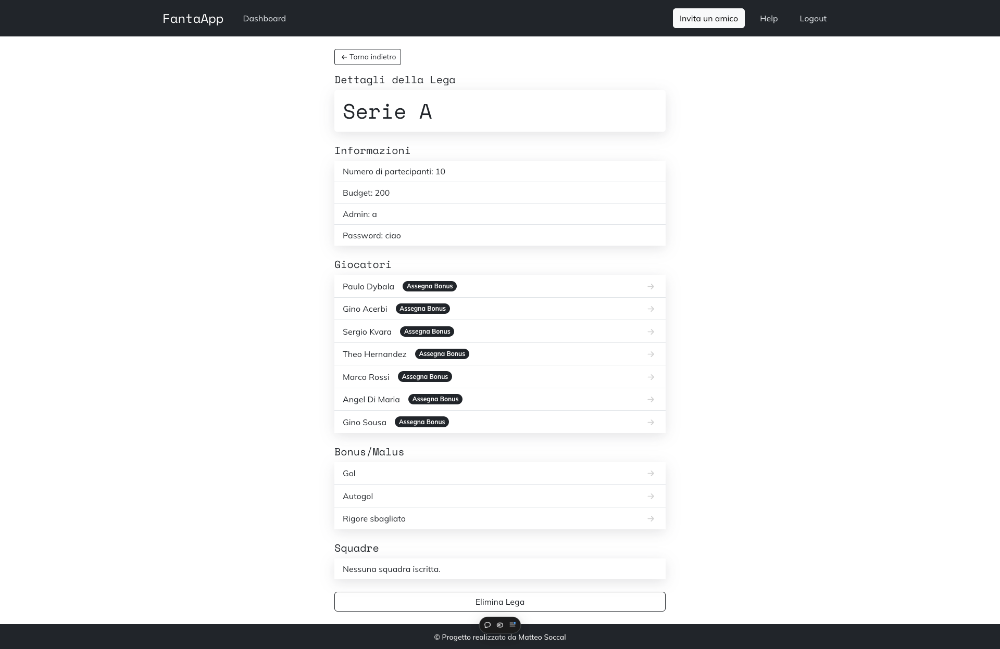

# ⚽ FantaApp



**FantaApp** è un'applicazione web per la gestione di leghe di fantacalcio, che permette agli utenti di creare leghe, formare squadre e competere con gli amici. L'app include funzionalità di autenticazione, gestione delle leghe e squadre, e un sistema di assegnazione di bonus e malus per personalizzare le performance dei giocatori.

## 🌐 Demo

👉 [Prova la demo qui!](https://fanta-app-pied.vercel.app/)

## ✨ Caratteristiche

- 🔐 **Autenticazione Utenti**: Registrazione e login tramite credenziali manuali o con Google, gestiti tramite JSON Web Tokens (JWT).
- 🏆 **Creazione e Gestione delle Leghe**: Gli admin possono creare leghe, definire le regole e i giocatori, e gestire le leghe esistenti.
- 🛠️ **Formazione delle Squadre**: I team owner possono iscriversi a una lega e creare la propria squadra, scegliendo i giocatori entro un budget prestabilito.
- 📈 **Assegnazione di Bonus/Malus**: Gli admin possono assegnare bonus e malus ai giocatori per influenzare i punteggi delle squadre.
- ✉️ **Invito a Nuovi Utenti**: Tramite la funzionalità "Invita un Amico", gli utenti possono invitare amici a unirsi all'applicazione.

## 💻 Tecnologie Utilizzate

### Frontend
- ⚛️ **React**: Libreria JavaScript per la costruzione di interfacce utente.
- 🎨 **React Bootstrap**: Libreria di componenti per creare interfacce responsive e stilizzate.

### Backend
- 🟢 **Node.js & Express**: Framework per costruire l'API RESTful e gestire la logica server-side.
- 🍃 **MongoDB**: Database NoSQL utilizzato per archiviare i dati di utenti, leghe, squadre e giocatori.
- 📄 **Mongoose**: Libreria per la modellazione di dati MongoDB con JavaScript.
- 🔑 **JWT**: Gestione dell'autenticazione e della sicurezza tramite JSON Web Tokens.

## ⚙️ Prerequisiti

- 📦 **Node.js** (versione 16 o superiore)
- 🗄️ **MongoDB** (locale o tramite un servizio cloud come MongoDB Atlas)

## 🚀 Installazione

1. **Clona il repository:**
   ```bash
   git clone https://github.com/tuo-username/FantaApp.git
   cd FantaApp

2. **Installa le dipendenze del backend:**
  cd backend
  npm install

3. **Installa le dipendenze del frontend:**
  cd ../frontend
  npm install

4. **Avvia il server backend:**
  npm start

5. **Avvia l'app React:**
  cd ../frontend
  npm start

6. **Apri l'app nel browser: Vai su http://localhost:3000**

## 📧 Contatti: Per qualsiasi domanda, contattami su matteosoccal.dev@gmail.com
